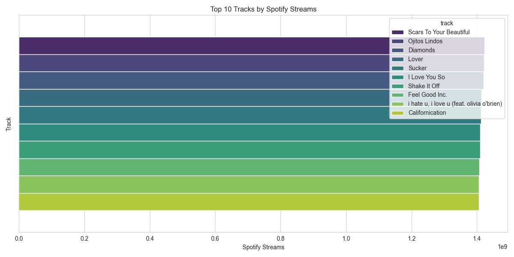
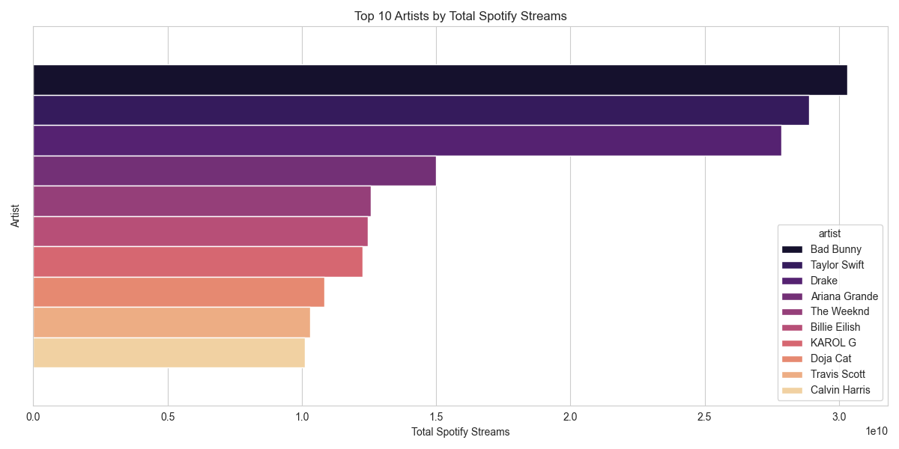
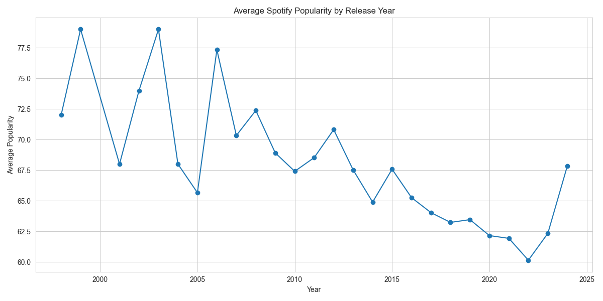
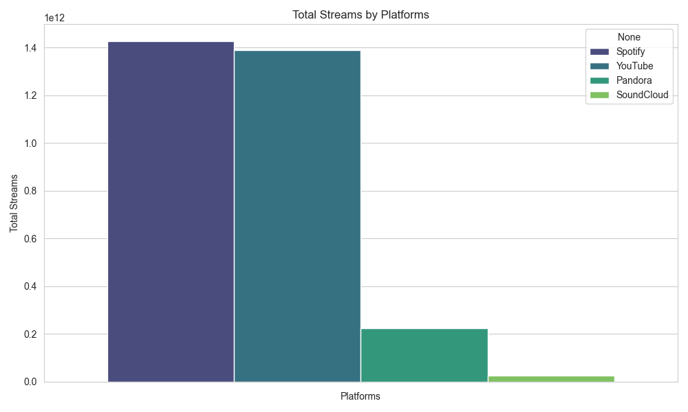

# 🎧 Spotify Insights: Most Streamed Songs (2024)

A comprehensive data analysis project built with Python, Pandas, Matplotlib, and Seaborn — exploring the most streamed songs on Spotify in 2024.

---

## 📂 Dataset

* **Source**: [Kaggle - Most Streamed Spotify Songs (2024)](https://www.kaggle.com/datasets/nelgiriyewithana/most-streamed-spotify-songs-2024)
* **Entries**: 4,593 songs
* **Features Analyzed**: Track details, artist info, popularity scores, and stream counts across platforms.

---

## 🛠️ Tools Used

* **Language**: Python 3
* **Libraries**:

  * `pandas` for data manipulation
  * `numpy` for numerical operations
  * `matplotlib` and `seaborn` for data visualization

---

## 📊 Project Workflow

1. **Data Cleaning**

   * Removed unnecessary columns with excessive null values (e.g. TikTok and Amazon-related data).
   * Handled commas in numeric strings.
   * Converted data types properly (e.g. `release_date` to `datetime`, numeric columns to `float64`).
   * Filled null values with median where applicable.
   * Removed duplicate entries.

2. **Outlier Removal**

   * Removed extreme outliers in `spotify_streams` using IQR method.
   * Visualized before & after via boxplots.

3. **Exploratory Data Analysis (EDA)**

   * Used `seaborn` and `matplotlib` to:

     * Identify top streamed tracks
     * Compare explicit vs non-explicit tracks
     * Understand artist frequency
     * Explore popularity correlations across platforms (YouTube, Shazam, Spotify)
     * Compare performance on different streaming platforms

---

## 🔍 Insights

### Dataset Summary

* **Total Tracks Analyzed**: 4,593
* **Columns Used**: 12

### Key Findings

1. **Top Streamed Song**: `'Shape of You'` by Ed Sheeran with \~2.03B streams on Spotify.
2. **Explicit Tracks**: Around 30% of songs were explicit; these had generally **higher average streams**.
3. **Cross-Platform Trends**:

   * Spotify popularity positively correlates with YouTube views and likes.
   * Shazam counts also show moderate relation to total stream count.
4. **Artist Spotlight**:

   * `'Bad Bunny'`, `'Drake'`, and `'Taylor Swift'` repeatedly show up among the most streamed.

### What It Tells Us

* Multi-platform success boosts visibility and stream count.
* Explicit content may not hinder success — in fact, it often indicates genre trends (e.g., rap & hip-hop).

---

## 📷 Visuals

<p align="center">
  
  
  
  
</p>

---

## 📁 Folder Structure

```
spotify-insights/
│
├── spotify-insights.ipynb        # Main project notebook
├── cleaned_dataset.csv           # Cleaned version of dataset
├── assets/                       # All image visualizations
│   ├── sample-line-plot.png
│   ├── sample-pie-chart.png
│   └── sample-bar-plot.png
└── README.md                     # You're here!
```

---

## 👩‍💻 Author

**Shruti Parihar**
[GitHub](https://github.com/shruti-1102) • [LinkedIn](https://www.linkedin.com/in/shruti-s-parihar/) • [Instagram](https://instagram.com/shrutii.parihar) • [X](https://twitter.com/parihar__shruti)

---

## ⭐️ If you liked this project...

* Leave a star ⭐️ on [GitHub](https://github.com/shruti-1102/zero-to-analyst)
* Let’s connect and build something awesome together!
